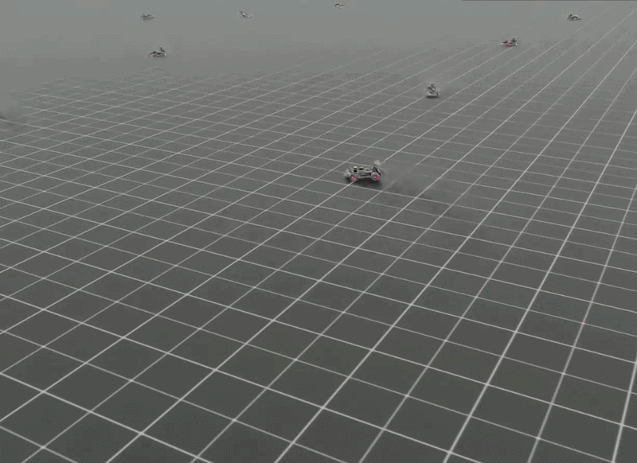
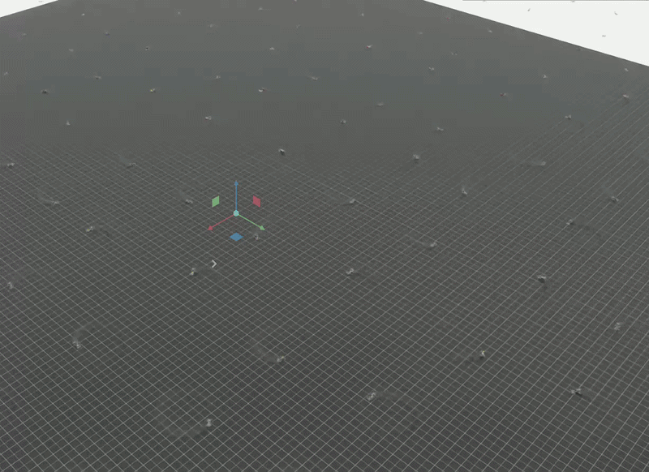

# Isaac Sim F1TENTH

An F1TENTH (Roboracer) car and racetrack in **NVIDIA Isaac Sim 4.5**, with

- a **ROS2 Humble** simulation (`/scan`, `/odom`, `/tf`, `/imu`, `/clock`, `/drive`), and
- a **massively parallel reinforcement-learning** environment (Isaac Lab, rsl_rl PPO, hundreds to thousands of cars at once).

The car and track geometry come from the [AutoDRIVE Simulator](https://github.com/AutoDRIVE-Ecosystem/AutoDRIVE-Simulator) (Unity build). The converted USD assets are included in `usd/`; `scripts/extract_unity.py` shows how they were extracted.






## 1. Prerequisites

| | |
|---|---|
| OS / GPU | Linux, NVIDIA GPU (tested: RTX A1000 6 GB, driver 580) |
| Isaac Sim / Isaac Lab | 4.5 + Isaac Lab in a conda env (created below), rsl-rl |
| ROS2 | Humble (only for the *checking* shell; Isaac Sim uses its bundled bridge libs) |

### Create the conda environment
```bash
git clone <this repo> && cd isaac_sim_f1tenth
scripts/create_env.sh            # conda env "env_isaaclab" (python 3.10) + Isaac Sim 4.5 (pip) + Isaac Lab v2.1.0 + rsl_rl + UnityPy
```
It is the standard Isaac Lab pip installation (~15 GB download, accept the NVIDIA EULA). Equivalent manual steps: `conda env create -f environment.yml`, `pip install "isaacsim[all,extscache]==4.5.0" --extra-index-url https://pypi.nvidia.com`, torch 2.5.1 (cu121), clone IsaacLab and run `./isaaclab.sh --install rsl_rl`.

**Already have an Isaac Lab env for Isaac Sim 4.5?** Use it instead, no new env needed:
```bash
export CONDA_ENV=my_isaaclab_env          # default: env_isaaclab
export ISAACLAB_DIR=/path/to/IsaacLab     # default: ~/IsaacLab
export ISAACSIM_DIR=/path/to/isaac-sim    # only if not <IsaacLab>/_isaac_sim or the pip package
```
> The project was developed and tested on an existing env (Isaac Sim 4.5.0 standalone linked at `IsaacLab/_isaac_sim`, Isaac Lab 2.3.2 dev, rsl-rl 5.0.1, Python 3.10). `create_env.sh` follows the official install route but has not been run end-to-end here; if a version mismatch appears, pin Isaac Lab to a release that supports Isaac Sim 4.5.

> `scripts/env_isaac.sh` also sets `PYTHONNOUSERSITE=1` (a torch in `~/.local` otherwise shadows the conda one and breaks Isaac Sim) and strips system-ROS paths from `LD_LIBRARY_PATH`. Always `source` it before any script below.

## 2. Quick check

The car (`usd/f1tenth.usd`), the tracks (`usd/tracks/<name>.usda`) and RL helper files (`rl/tracks/<name>/`) are included in the repo, so nothing has to be extracted or built.
```bash
source scripts/env_isaac.sh
python scripts/test_car.py      # car loads, drives and steers on a flat ground
```

<details><summary>Optional: regenerate the assets from the AutoDRIVE Unity build</summary>

```bash
pip install -r requirements.txt                       # UnityPy
scripts/regenerate_assets.sh /path/to/compete_icra25/autodrive_simulator/Data \
    cdctf25=/path/to/compete_linux_cdctf25/autodrive_simulator/Data explore26=/path/to/explore_icra26/autodrive_simulator/Data
```
Runs `extract_unity.py` (raw meshes into `assets/raw/`, git-ignored; extra builds go to `assets/raw/builds/<key>/` via `--out-dir ... --only track`), then rebuilds `usd/f1tenth.usd`, `usd/tracks/*.usda` and `rl/tracks/<name>/{track_col.usda,centerline.npy,meta.json}`. The track table (name -> Unity node + source build) is `assets/tracks.json`; the `cdctf25=`/`explore26=` builds are optional (without them only the icra25-build tracks are rebuilt). Single steps: `build_track_usd.py --track <name>`, `rl/build_track_collision.py <name>...`, `rl/build_centerline.py <name>...`.
</details>

## 3. Tracks

| `--track` | Unity track | source build | length of centerline |
|---|---|---|---|
| `icra25` (default) | SRL 2025 ICRA | compete_icra25 (also practice, cdctf25, explore26) | 62 m |
| `cdctf25` | SRL 2025 CDC-TF | compete_linux_cdctf25 (also explore26) | 46 m |
| `iros24` | SRL 2024 IROS | iros24, cdc24, icra25, practice, cdctf25, explore26 (identical geometry) | 54 m |
| `cdc24` | SRL 2024 CDC | cdc24, icra25, practice, cdctf25, explore26 (identical) | 54 m |
| `berlin` | Berlin (0.5 scale) | cdc24, icra25, practice, cdctf25 (identical) | 64 m |
| `porto` | Porto | cdc24, icra25, practice, cdctf25, explore26 (identical) | 34 m |
| `berlin26` | Berlin, larger 1.0-scale re-model (166k verts) | explore_icra26 only | 74 m |

`--track list` prints the names. All 6 builds contain the same geometry per track (checked by vertex hash), except the two Berlin variants above, so nothing else was added. Spawn = Unity `Spawn 1`; the centerline is built from the Unity checkpoints and pulled to the wall-distance ridge.

### Tracks from a SLAM map
`rl/map_to_track.py` turns a ROS map (`.pgm` + `.yaml`) and a waypoint csv (`x_m,y_m,...`) into a track the RL scripts accept:
```bash
python rl/map_to_track.py maps/iee2.yaml --csv maps/iee2.csv      # -> rl/tracks/iee2/{track_col.usda,centerline.npy,meta.json,preview.png}
python rl/train.py --track iee2 --headless
```
Occupied pixels are thickened (`--thickness`, 0.1 m) and extruded to `--height` (0.3 m); unknown pixels are treated as wall too (`--open-unknown` disables that). The csv gives the centerline and driving direction; the first point is the spawn. `preview.png` shows the centerline on the map.

## 4. ROS2 simulation

```bash
source scripts/env_isaac.sh
export ROS_DOMAIN_ID=77                    # private domain, avoids clashes with other sims
python scripts/run_sim.py --headless       # drop --headless for the GUI; --seconds N stops after N s; --track <name> (default icra25)
```
| topic | type | notes |
|---|---|---|
| `/clock` | rosgraph_msgs/Clock | sim time |
| `/odom` | nav_msgs/Odometry | relative to the settled spawn pose |
| `/tf` | tf2_msgs/TFMessage | odom→base_link, base_link→lidar, base_link→imu_link |
| `/scan` | sensor_msgs/LaserScan | frame `lidar`, 270°, 1080 samples, 0.06–10 m (PhysX raycast, ~60 Hz) |
| `/imu` | sensor_msgs/Imu | frame `imu_link` |
| `/drive` (in) | ackermann_msgs/AckermannDriveStamped | `speed` m/s, `steering_angle` rad (+left, ±22.9°) |

Verify and drive from a **clean shell** (do not source `env_isaac.sh` there):
```bash
env -i HOME=$HOME ROS_DOMAIN_ID=77 RMW_IMPLEMENTATION=rmw_fastrtps_cpp bash -c \
  'source /opt/ros/humble/setup.bash; ros2 topic list; python3 scripts/check_ros.py'
env -i HOME=$HOME ROS_DOMAIN_ID=77 RMW_IMPLEMENTATION=rmw_fastrtps_cpp bash -c \
  'source /opt/ros/humble/setup.bash; ros2 topic pub -r 20 /drive ackermann_msgs/msg/AckermannDriveStamped "{drive: {speed: 1.0, steering_angle: 0.1}}"'
```

## 5. Reinforcement learning

```bash
source scripts/env_isaac.sh
python rl/train.py --num_envs 256 --headless --max_iterations 300     # checkpoints: rl/logs/<date>/model_*.pt
python rl/train.py --num_envs 2048 --headless --max_iterations 1000 --track porto   # other track (see section 3; play.py, bench.py take --track too)
python rl/play.py  --num_envs 16                                      # newest checkpoint, with GUI
python rl/play.py  --checkpoint rl/logs/<date>/model_299.pt
python rl/bench.py --num_envs 1024 --headless                         # throughput
```
`play.py` prints the lap time of car 0. On a 6 GB GPU use `--headless` for training; the PhysX GPU buffers in `F1TenthEnvCfg.sim` are sized for that.
- **Observation** (113): 108 normalised lidar rays (270°, 10 m), body-frame `vx, vy, yaw-rate`, previous action.
- **Action**: `[steer, speed]` in [-1, 1] → ±0.4 rad Ackermann steering, 0–7.2 m/s target speed (`max_speed`).
- **Reward**: 10 per metre of progress along the track centreline, −0.1 per step (rewards fast laps), −0.05·steering-rate, −10 on crash. An episode ends when the lidar minimum < 0.12 m, on flip, after 2 s below 0.1 m/s, or after 30 s. Edit `rl/f1tenth_env.py` to change it; PPO settings are in `rl/rsl_cfg.py`.
- All envs share one track mesh (cars do not collide with each other), which keeps VRAM low and makes the track size irrelevant for memory (2048 envs on the biggest track `berlin26`: ~4.1 GB).
- A checkpoint is not tied to a track (same observation), so `play.py --track X --checkpoint ...` also tests generalisation.

Measured env steps/s (random actions, 6 GB GPU): 64 → 2.6k, 256 → 5.1k, 1024 → 6.0k, 2048 → 10.9k, 4096 → 11.6k (~4.3 GB VRAM; keep other GPU jobs off).

## 6. Overtaking
`rl/overtake.py` trains a policy from scratch to overtake slower cars. Every env holds the learner plus one opponent driven by a frozen, pre-trained lap policy with its throttle scaled by `--opp_speed_scale` (default 0.5). The opponent appears in the learner's lidar as a circle (radius 0.15 m) merged with the wall distances, so the observation is the same 113 values as in section 5. Extra reward: +5 for passing the opponent along the centreline.
```bash
python rl/overtake.py --opp_checkpoint rl/logs/<run>/model_250.pt --track porto --num_envs 64 --headless --max_iterations 1000
python -u rl/overtake.py --play --opp_checkpoint rl/logs/<run>/model_250.pt --checkpoint rl/logs/overtake/<run>/model_N.pt --num_envs 1   # prints overtakes and lap times
```
`--checkpoint` on a training run resumes the learner. The opponent cannot see the learner and the learner cannot tell it from a wall; its speed is not observed.

## 7. Drift policy (no track)

A separate RL task on a flat ground plane: learn to hold a sustained drift around a point (`circle`) or along a figure-eight (`eight`). Independent of the track environment above; see [`rl_drift/README.md`](rl_drift/README.md).
```bash
source scripts/env_isaac.sh
python rl_drift/train.py --task circle --num_envs 512 --headless --max_iterations 1500
python rl_drift/play.py  --task circle --checkpoint rl_drift/logs/circle/<run>/model_N.pt --num_envs 16
```

## 8. Running a policy on the real car (ROS2)
`deploy/` has plain scripts (ROS2 Humble + numpy on the robot, no torch/Isaac). Export a checkpoint once on the training PC, then run on the car; both publish `AckermannDriveStamped` on `/drive` at 30 Hz and stop the car when `/odom` or the sensor input is older than 0.3 s.
```bash
python deploy/lap_ros2.py export rl/logs/<run>/model_250.pt deploy/lap.npz
python3 deploy/lap_ros2.py run deploy/lap.npz --dry-run                  # prints the commands only
python3 deploy/lap_ros2.py run deploy/lap.npz --speed-scale 0.4          # start slow; --pointcloud for a PointCloud2 input, --scan <topic>
python deploy/drift_ros2.py export rl_drift/logs/eight/<run>/model_N.pt deploy/eight.npz     # drift policy, see rl_drift/README.md
python3 deploy/drift_ros2.py run deploy/eight.npz --task eight --dry-run
```
The lap policy needs the scan resampled to the 108 training rays (270°, 10 m); `lap_ros2.py` does that. Sim and real differ in dynamics (no latency, noise or friction randomisation in training) and in lidar mounting (0.113 m in sim), so test at low speed first.

## Layout
```
scripts/  create_env.sh  env_isaac.sh  regenerate_assets.sh  extract_unity.py  build_track_usd.py  build_car_usd.py
          run_sim.py (ROS2 sim)  check_ros.py  test_car.py  verify_track.py [name]
rl/       f1tenth_env.py  rsl_cfg.py  train.py  play.py  bench.py  track_util.py  build_centerline.py  build_track_collision.py
          overtake_env.py  overtake.py  map_to_track.py
deploy/   lap_ros2.py  drift_ros2.py  (+ exported .npz policies)
usd/f1tenth.usd  usd/tracks/<name>.usda  rl/tracks/<name>/{track_col.usda,centerline.npy,meta.json}   <- included assets
assets/tracks.json  assets/raw/  Unity hierarchy.json + track texture (meshes are git-ignored, see optional step)
```
Car: 0.33 m wheelbase, 0.236 m track, 0.118 m wheel diameter, 3.47 kg. Frames: Z-up, +X forward, spawn at (-3.0, 0.8, 0.01).

## Known issues
- Lidar is a PhysX raycast (no noise/intensity), not RTX.
- Runtime fixes in `run_sim.py` (USD left untouched): the thin 200×200 ground cube is replaced by a slab (the car sank into it), track collision is switched to `sdf` (triangle-mesh contact segfaulted `omni.physx`), CPU physics.
- Rear wheel centres are 1 cm lower than the front (as in the source CAD), so the car rests pitched ~1.7°: `/odom` z drifts ~3 % and `/imu` reads ~0.3 m/s² on x at rest.
- `usd/tracks/*.usda` have unwelded (UV-duplicated) vertices; PhysX cooking hangs in Isaac Lab, hence `rl/tracks/<name>/track_col.usda` (welded copy).
- Centerlines wiggle a few cm (ridge search on a 2 cm grid); clearance to walls is >= 0.36 m on all tracks.
- Scripts that end via Kit's shutdown lose buffered stdout when redirected to a file: set `PYTHONUNBUFFERED=1`.
- Suspension/tyre-friction of the Unity model were not recoverable; friction values are estimates.
- ~1 in 5 starts `omni.physx` may segfault when the GPU is shared: just restart. Out-of-memory looks the same, so check `nvidia-smi` first.
- Use `timeout -s KILL` (Kit ignores plain `timeout`).

## License / attribution
